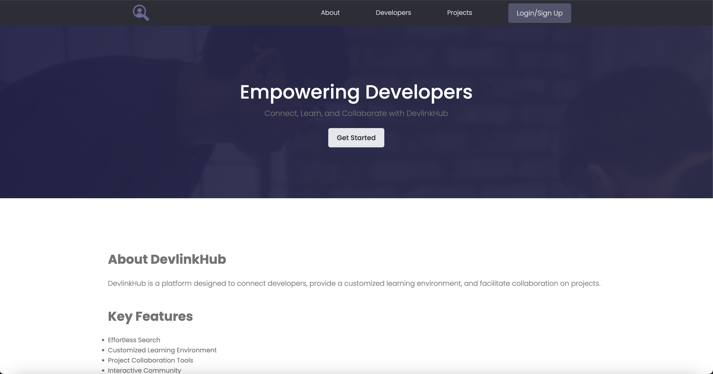
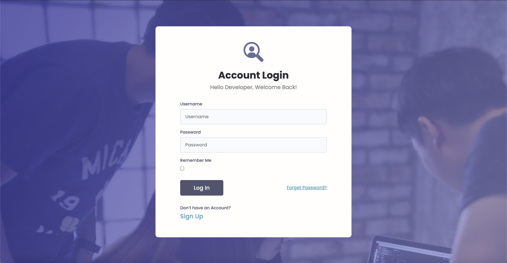
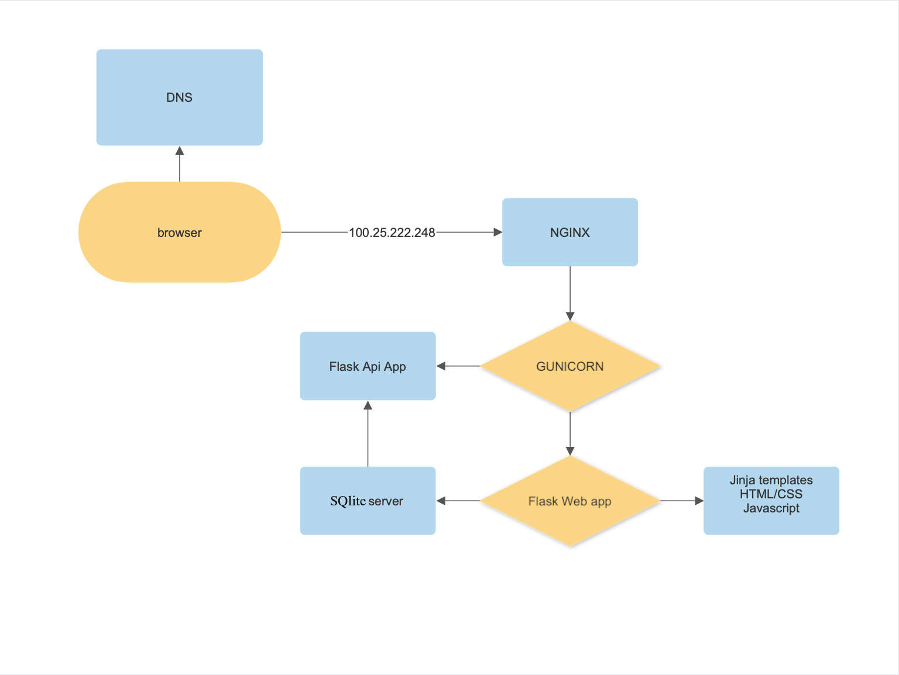

# DevLinkHub - Connect with other developers, enjoy a customized learning environment, and effortlessly revisit learned concepts through search.

## Introduction

### The Project

DevlinkHub addresses the scenario where a student needs to revisit some concepts but has to go through the entire curriculum to find a specific concept to read about. Sometimes, you don't even remember in which project you learned that concept. It might even be just a keyword. DevlinkHub will help you search for projects by concept, programming language, or any keyword you want. It provides an enhanced, customized learning environment where you can take notes about your takeaways. You can also go back to each project and find your notes linked to that project. The platform also enhances user interaction, allowing users to share insightful resources about projects.

### The Context

This project serves as my Portfolio Project, marking the conclusion of my specialization at ALX - Holberton School. Despite the option to work in a team, I chose to work solo due to availability constraints. I aimed to create a seamless experience for book enthusiasts while showcasing my coding skills.

### The Team

I am Jules Ntizimira, a passionate coder with a unique perspective fueled by a love for tech and entrepreneurship. Follow me on [Twitter](https://twitter.com/NtizimiraJ) for more tech-related updates.

## User Stories

As a Developper:
* Login: As a user, I want to be able to log into the DevlinkHub platform securely using my username and password.
* Signup: As a new user, I want to create an account on DevlinkHub by providing my email, username, and password.
* Password Reset through Email: As a user, I want the option to reset my password via email if I forget it, ensuring secure access to my account.
* View All Projects on the Platform: As a user, I want to see a comprehensive list of all projects available on the DevlinkHub platform.
* View All Developers: As a user, I want to browse and view profiles of all developers registered on DevlinkHub.
* Interact with Others through Comments: As a user, I want to comment on projects and interact with other users and developers by leaving comments and receiving feedback.
* Messages Between Users: As a user, I want to send and receive private messages to communicate with other users and developers on the platform.
* Effortless Search for Projects, Concepts, or Keywords: As a user, I want to easily search for projects, concepts, or keywords across the platform to find relevant information quickly.
* See a Note on Every Project: As a user, I want to have a note section on every project where I can write and save my thoughts, ideas, or takeaways related to that project.
* Logout: As a user, I want to securely log out of my DevlinkHub account to protect my privacy and data.

**Acceptance Criteria:**
- Users can create a profile
- Browse diverse projects
- Search for specific project by title, tag, or concepts and keywords
- View detailed project information and user reviews
- receive notification on message

## Blog Posts

After the development phase, I wrote a reflective blog post on the Tradit journey.

Read the blog post: [Tradit: Swap Books — Share the Joy](https://medium.com/@ntizimijules5/swap-books-share-the-joy-229b658b00fb)

## Tutorial

Take a tour of the deployed version at [DevLinkHub](http://192.168.1.64:5200).

Here is a little preview of our main feature, the landingpage:

Here is a preview for the login page:

## Known Bugs

- The app is slow due to pictures being saved on the server
- Not responsive views

## Architecture

### Overview

The web app comprises Python and MySQL on the backend, with Flask as the framework interface. HTML/CSS and JavaScript handle frontend functionalities. Nginx manages the server side, served by the Gunicorn application server. An additional app for API runs on different ports. For certain functionalities, the main app accesses the server directly, while others use the API.

### List of Components

These components define the user experience in Tradit, with each component housing code for a specific app page. Components can be located in [webdynamic/templates](./webdynamic/templates).

| Component     | Description                                      |
| ------------- | ------------------------------------------------ |
| [Index](./webdynamic/Landing.vue)   | Landing page for users on Tradit                 |
| [Login](./webdynamic/templates/login.html)   | Login page with a link to the Signup page         |
| [Community](./webdynamic/templates/users.html) | Page displaying other users                     |
| [Chat Room](./webdynamic/templates/room.html) | Secure chat room for users                       |
| [Signup](./webdynamic/templates/register.html) | Signup page requiring user information           |
| [Dashboard](./webdynamic/templates/book.html) | Main page where users explore available books    |
| [About](./webdynamic/templates/book.html) | Information page about the platform              |
| [Register Book](./webdynamic/templates/registerb.html) | Page for users to register a new book    |

## Authentication

Implementing a robust authentication system was a pivotal aspect of Tradit's development. To achieve this, I delved into learning Flask-Login, a tool that streamlined the management of user logins. Flask-Login not only facilitated a secure and seamless login experience but also provided valuable functionalities such as handling the current user. By leveraging this technology, Tradit ensures that user authentication is not just a procedural step but a feature that enhances the overall user experience.

## Socket Chat Rooms

Real-time communication is at the heart of Tradit's user interaction, and this is made possible through the implementation of socket chat rooms. These chat rooms offer users a secure and dynamic environment to engage in live conversations. When a user expresses interest in a particular book, the chat room becomes the conduit for direct communication with the owner, allowing them to finalize the details of the book exchange securely. The integration of socket chat rooms adds a layer of immediacy and interactivity, making Tradit more than just a platform for book exchange but a community where users can connect effortlessly.

# Acknowledgments

- ALX staff: For the help, advice, and resources throughout the project and curriculum.
- Cohort 13 and all ALX students: For friendship, support, and insights over the last year.
- YOU: For reading this documentation and testing out Tradit. We hope you enjoyed the ride!

# Related Projects

- [AirBnB Clone](https://github.com/Julesntizimira/AirBnB_clone_v4): A web app in Python, Flask, and JQuery.
- [Simple Shell](https://github.com/Julesntizimira/simple_shell): A command line interpreter replicating the sh program.
